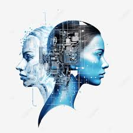
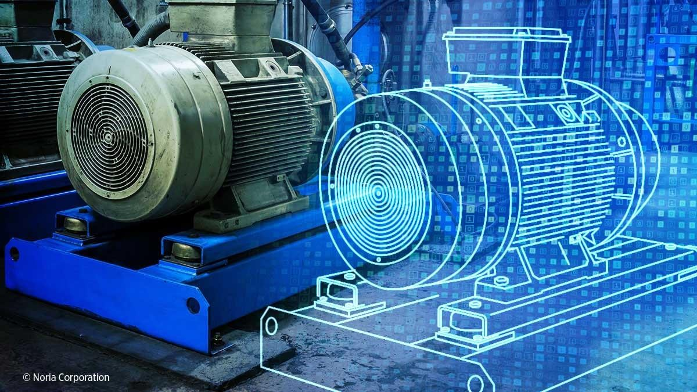
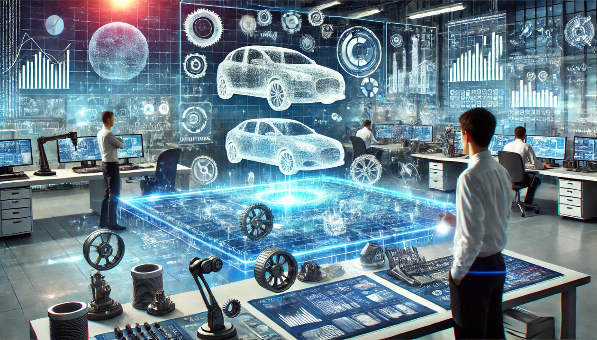
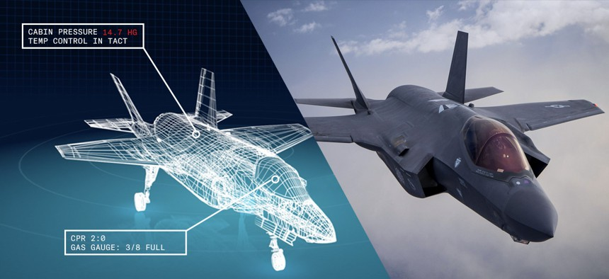

# **DIGITAL TWIN**
### *A way to integrate real-world objects into the digital world!*
## What is digital twin?
 A digital twin is a digital representation of a physical object, process, service or environment that behaves and looks like its counterpart in the real-world. In other words, a digital twin is a digital representation of a physical object, process, service or environment that behaves and looks like its counterpart in the real-world.
## Digital twin technology:

  

    
   Digital twin technology can be used to replicate processes or runs simulations in order to collect data that can predict the performance accuracy of the product or system.Digital twin technology allows you to oversee the performance of an asset, identify potential faults, and make better-informed decisions about maintenance and lifecycle.
  

  

  

 
## What are the benefits of digital twins?
Digital twins offer users many benefits. We’ll unpack some of the following:

-  **Improved performance-** 

   Real-time information and insights provided by digital twins let you optimize the performance of your equipment, plant, or facilities. Issues can be dealt with as they occur, ensuring systems work at their peak and reduce downtime.

- **Predictive capabilities-** 

  Digital twins can offer you a complete visual and digital view of your manufacturing plant, commercial building, or facility even if it is made up of thousands of pieces of equipment. Smart sensors monitor the output of every component, flagging issues or faults as they happen. You can take action at the first sign of problems rather than waiting until equipment completely breaks down.

- **Remote monitoring-** 

  The virtual nature of digital twins means you can remotely monitor and control facilities. Remote monitoring also means fewer people have to check on potentially dangerous industrial equipment.

-  **Accelerated Production Time-** 

    You can accelerate production time on products and facilities before they exist by building digital replicas. By running scenarios, you can see how your product or facility reacts to failures and make the necessary changes before actual production.
    

## Types of digital twins: 

1.  **Component twins:**  
 Component twins, or parts twins, are the digital representation of a single piece of an entire system. These are essential parts of the operation of an asset, such as a motor within a wind turbine.

2. **Asset twins:** Asset twins
 In digital twin terminology, assets are two or more components that work together as part of a more comprehensive system. Asset twins virtually represent how the components interact and produce performance data that you can analyze to make informed decisions.

3. **System twins:** System twins
 A higher level of abstraction from asset twins are system twins, or unit twins. A system twin shows how different assets work together as part of a broader system. The visibility offered by system twin technology allows you to make decisions about performance enhancements or efficiencies.

4.  **Process twins:** Process twins
 Process twins show you the digital environment of a whole object and provide insight into how its various components, assets, and units work together. For example, a digital process twin can digitally reproduce how your entire manufacturing facility is operating, bringing together all of the components within it.

 ## Use of Digital Twins:

### Manufacturing:

  In manufacturing, digital twins optimize operations, reduce downtime, and enhance efficiency by simulating factory floors. They enable predictive maintenance by detecting issues early through real-time data and allow product design and testing in a virtual environment before physical prototyping.Some real-time applications are seen in manfacturing companies like:

  - Automobile: Tesla, BMW, Rolls-Royce,etc.
  - Other companies include IBM, Siemens, Cosco,etc.
  

### Aerospace and Defence:

  In aerospace and defense, digital twins monitor aircraft parts to predict failures and reduce downtime. They also simulate spacecraft operations and provide virtual environments for pilot and defense personnel training.Some real-time apllication are presently seen in:

 - *Space Force*. This branch of the US Armed Forces is creating a digital twin of space, including replicas of extraterrestrial bodies and satellites.

 - *SpaceX*. A digital twin of SpaceX’s Dragon capsule spacecraft enables operators to monitor and adjust trajectories, loads, and propulsion systems with the goal of maximizing safety and reliability during transport.

 
  
  ## In Conclusion, Digital Twins are Revolutionizing Industries
  Digital twin technology is changing how systems and physical objects are optimized.Digital twins will become a must-have tool for manufacturers as they evolve and integrate with AI technologies.This technology will improve decision-making, predictive maintenance, and R&D. 

